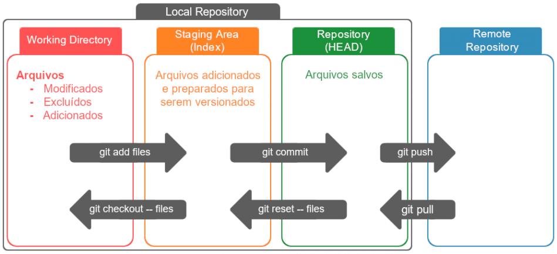

# O que é versionamento ?

O versionamento de código é o processo de acompanhar, controlar e gerenciar as alterações feitas em um projeto de desenvolvimento de software ao longo do tempo. Ele envolve o uso de sistemas de controle de versão para registrar e acompanhar as modificações feitas no código-fonte.

### Alguns pontos importante sobre versionamento:

- Existem diferentes sistemas de controle de versão disponíveis, como o Git, o Subversion (SVN) e o Mercurial. Esses sistemas permitem que os desenvolvedores trabalhem em conjunto, gerenciando e compartilhando seu código de maneira eficiente.
- Os sistemas de controle de versão permitem que várias pessoas trabalhem no mesmo projeto ao mesmo tempo, facilitando a colaboração. Eles registram cada alteração feita no código-fonte, permitindo que você volte a versões anteriores do projeto, se necessário. Isso é especialmente útil quando você deseja corrigir um bug introduzido em uma versão posterior ou experimentar diferentes abordagens de desenvolvimento.
- O versionamento de código também permite a criação de branches (ramificações), que são cópias independentes do código-fonte principal. Os branches são úteis para desenvolver recursos em paralelo, sem interferir no código principal. Depois que um recurso é concluído e testado, ele pode ser mesclado (merged) de volta ao ramo principal.
- Além disso, os sistemas de controle de versão fornecem recursos para a colaboração em equipe, como mesclagem de alterações feitas por diferentes desenvolvedores, resolução de conflitos de código e rastreamento de quem fez quais alterações.

 

## O que é Git ?

O Git é um sistema de controle de versão distribuído amplamente utilizado para o gerenciamento de projetos de desenvolvimento de software. Ele foi criado por Linus Torvalds em 2005, com o objetivo de ser rápido, eficiente e escalável, especialmente para projetos de código aberto de grande porte, como o Linux. Ao contrário de sistemas de controle de versão centralizados, como o Subversion, o Git é descentralizado. Isso significa que cada desenvolvedor possui uma cópia completa do repositório, incluindo todo o histórico de alterações. Isso permite que os desenvolvedores trabalhem offline e de forma independente, sem depender de um servidor central.

O Git é conhecido por sua rapidez e desempenho, tornando-o uma escolha popular entre os desenvolvedores. Ele é projetado para lidar com projetos de qualquer tamanho, desde pequenos scripts até grandes projetos de software. Ele usa um modelo de rastreamento de alterações baseado em snapshots, onde cada alteração é registrada como uma imagem instantânea (commit) do estado do código em um determinado momento.

### Algumas características principais do Git incluem:

1. Ramificação (branching): O Git facilita a criação e o gerenciamento de branches, permitindo que os desenvolvedores trabalhem em paralelo em diferentes recursos ou correções de bugs. Isso possibilita o desenvolvimento isolado de novas funcionalidades, sem interferir no código principal, e a mesclagem posterior dessas alterações.
2. Mesclagem (merging): O Git permite mesclar branches de forma eficiente, combinando as alterações feitas em diferentes ramos. Ele pode lidar automaticamente com mesclagens simples, mas também é capaz de resolver conflitos quando as mesclagens não são triviais e exigem intervenção manual.
3. Rastreamento de alterações: O Git mantém um histórico completo de todas as alterações feitas no projeto. Cada alteração é registrada como um commit, que inclui informações sobre o autor, a data e a mensagem descritiva. Isso facilita a visualização do histórico, a identificação de quem fez quais alterações e a reversão para versões anteriores, se necessário.
4. Colaboração: O Git suporta a colaboração em equipe, permitindo que os desenvolvedores compartilhem e sincronizem suas alterações. É possível hospedar repositórios Git em servidores remotos, como o GitHub, o GitLab ou o Bitbucket, facilitando a colaboração entre desenvolvedores e o compartilhamento de código.

### Como são feitas os snapshots no Git ?

No Git, as snapshots são chamadas de commits. Um commit representa uma imagem instantânea do estado atual do repositório, ou seja, uma versão específica do projeto. Cada commit contém informações sobre as alterações feitas desde o último commit e inclui um identificador único (hash) que o distingue dos demais.

Quando você faz um commit no Git, ele registra todas as alterações realizadas nos arquivos do projeto desde o último commit. Isso inclui adição de novos arquivos, modificação de arquivos existentes e exclusão de arquivos. No entanto, o Git não armazena cada versão completa de cada arquivo em cada commit, o que seria ineficiente em termos de armazenamento. Em vez disso, ele utiliza um modelo de estrutura de dados chamado "árvore de objetos" (object tree) para armazenar as alterações de forma eficiente.

#### A árvore de objetos do Git é baseada em três tipos principais de objetos:

1. Blob (Binary Large Object): Representa o conteúdo de um arquivo em um determinado momento. Os blobs armazenam as diferenças em relação à versão anterior do arquivo, economizando espaço no armazenamento.
2. Tree (Árvore): Representa um diretório e contém informações sobre quais arquivos e subdiretórios estão presentes nele. Cada árvore aponta para os blobs que contêm o conteúdo dos arquivos.
3. Commit (Compromisso): Representa um estado específico do repositório em um determinado momento. Um commit contém referências para árvores e commits anteriores, bem como informações adicionais, como o autor, a mensagem de commit e a data.

 

##### Links úteis

[Awari - Versionamento de código](https://awari.com.br/versionamento-de-codigo/) 
[Versionamento de código e linguagem R](https://prdm0.github.io/aulas_computacional/pref%C3%A1cio.html#sugest%C3%B5es-de-passos-para-revis%C3%A3o-da-linguagem-r)

 

 

 

[Voltar ao inicio](/README.md)