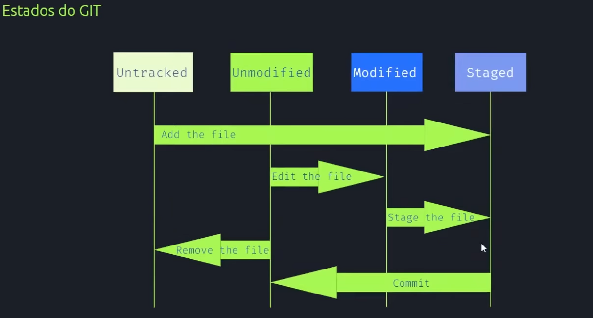

# Estudo de fluxo do Git

## Representação dos estados do Git



### O que significa cada estágio:

#### `Untracked` (Não rastreado) 
Um arquivo é considerado "não rastreado" quando o Git não está monitorando suas alterações. Isso significa que o arquivo existe no diretório de trabalho, mas ainda não foi adicionado à área de preparação (staging area) usando o comando `git add`. Esses arquivos não serão incluídos nos commits até que você os adicione explicitamente à área de preparação.

#### `Unmodified` (Não modificado) 
Um arquivo é considerado "não modificado" quando o Git está monitorando-o, mas não houve nenhuma alteração feita nele desde o último commit. Esses arquivos estão na versão mais recente do repositório e não requerem nenhuma ação adicional.


#### `Modified` (Modificado)
Um arquivo é considerado "modificado" quando foram feitas alterações nele após o último commit. Isso inclui adições, exclusões ou modificações de conteúdo do arquivo. Os arquivos modificados precisam ser adicionados à área de preparação para que as alterações sejam incluídas no próximo commit.


#### `Staged` (Preparado) 
Um arquivo é considerado "preparado" (ou "staged") quando foi adicionado à área de preparação (staging area) usando o comando `git add`. Isso significa que o Git está ciente das alterações feitas no arquivo e as incluirá no próximo commit. Os arquivos preparados estão prontos para serem incluídos no histórico do Git ao fazer um commit usando o comando `git commit`.

<br>

## O Git possui três estados principais que os arquivos podem estar durante o processo de versionamento. 

### Esses estados são:

**1. Working Directory (Diretório de trabalho):** É o estado em que os arquivos estão no seu diretório local, onde você realiza as modificações. Nesse estado, você pode adicionar, modificar ou excluir arquivos livremente.
**2. Staging Area (Área de preparação ou index):** É o estado intermediário entre o diretório de trabalho e o repositório. Após fazer modificações nos arquivos no diretório de trabalho, você seleciona especificamente quais alterações deseja incluir no próximo commit e adiciona essas alterações à área de preparação. Isso permite que você agrupe as mudanças em partes lógicas antes de confirmá-las.
**3. Repository (Repositório):** É o estado em que as alterações são efetivamente registradas no histórico do Git. Quando você faz um commit, as alterações presentes na área de preparação são armazenadas no repositório Git como uma nova versão do projeto, representada por um novo commit. O repositório contém o histórico completo de todos os commits e é o estado de referência para recuperar versões anteriores do projeto.

### A transição entre esses estados ocorre com o uso de comandos do Git:
- Para adicionar arquivos modificados ou novos à área de preparação (staging area), você utiliza o comando `git add`. 

    ```bash
    # Exemplo 1: adicionando 1 arquivo na área de preparação
    git add arquivo.txt

    # Exemplo 2: adicionando todos os arquivos modificados na área de preparação
    git add arquivo.txt
    ```

- Após adicionar os arquivos à área de preparação, você pode revisar as alterações que serão incluídas no próximo commit usando o comando `git status`. Ele exibe os arquivos modificados, os arquivos adicionados à área de preparação e os arquivos que ainda não foram rastreados.

    ```bash
    # Exemplo: Verificando as alterações no stage area
    git status
    ```

- Para confirmar as alterações presentes na área de preparação e criar um novo commit no repositório, você utiliza o comando `git commit`.
   
   ```bash
    # Exemplo: Criando novo commit com uma mensagem descritiva
    git commit -m "Mensagem descritiva da alteração"
    ```

- Após o commit, os arquivos no diretório de trabalho podem ser modificados novamente, criando uma nova versão das alterações. Essas novas alterações devem ser adicionadas à área de preparação novamente antes de fazer um novo commit. Podemos verificar os commits feitos com o comando `git log`. O comando mostrará os commits dos mais novos para os antigos

    ```bash
    # Exemplo: Verificando os commits realizados
    git log
    ```
<br>

<br>

[Voltar ao inicio](/README.md)