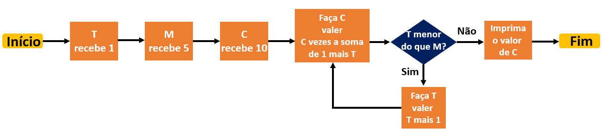

## Exercícios II

## Questão 1

A equipe de desenvolvedores da Ada está testando um algoritmo que realiza cálculos. O fluxograma abaixo mostra como ele funciona:



Ao executar o algoritmo, qual é o valor de C impresso ao final ?

<details>
<summary>Resposta:</summary>

7200

</details>

<br>

## Questão 2

O código de um programa para cadastro de alunos da Let's Code realiza a seguinte validação das variáveis `Nome` e `CPF`:

`SE(Nome não é vazio E CPF não é vazio) CONTINUE`

Essa validação avalia um dos percursos possíveis, no qual os dados foram preenchidos corretamente e com isso faz com que o sistema continue. Se a validação fosse programada para avaliar o preenchimento incorreto dos dados, qual das seguintes expressões seria utilizada?

<details>
<summary>Resposta:</summary>

SE(Nome é vazio OU CPF é vazio) PARE

</details>

<br>

## Questão 3

Sabe-se que:

- `ESCREVA` é o comando que escreve uma informação na tela;
- `<-` atribui um valor a uma variável;
- Variável é um espaço na memória do computador capaz de reter e apresentar um valor.

Observe o código abaixo:

```
A <- 30
B <- 20
C <- A + B
ESCREVA C
B <- 10
ESCREVA B, C
C <- A + B
ESCREVA A, B, C

```

Ao executar este código, o que será impresso na tela ?

<details>
<summary>Resposta:</summary>

```
> 50
> 10 50
> 30 10 40
```

</details>

<br>

## Questão 4

Sabe-se que:

- `REAL x` cria a variável x que armazena dados do tipo número real;
- `SE` divide o fluxo do programa em dois, um representado por `ENTAO`, que roda se a condição é satisfeita e o outro representado por `SENAO`, que roda quando a condição não é satisfeita;
- `` é o operador matemático de `subtração`;
- `==` e `>` são os operadores relacionais `igual a` e `maior que`, respectivamente.

```

ESCREVA "--- Moisés, bem-vindo ao App Ada Poupança ---"

INTEIRO i
REAL valor, saldo, poupanca

saldo <- 1000.00
poupanca <- 500.00
i <- 0

ENQUANTO i != 3 FAÇA
    ESCREVA "Digite 1 para APLICAR, 2 para RESGATAR e 3 para SAIR: "
    LEIA i
    SE i == 1 ENTAO FAÇA
        ESCREVA "Valor da aplicação: "
        LEIA valor
        SE valor > saldo ENTAO FAÇA
            ESCREVA "Saldo de conta corrente insuficiente"
        SENAO FAÇA
            saldo <- saldo - valor
            poupanca <- poupanca + valor
            ESCREVA "Aplicação realizada com sucesso"
        FIM_SE
    SENAO FAÇA
        SE i == 2 FACA
            ESCREVA "Valor do resgate: "
            LEIA valor
            SE valor > poupanca ENTAO FAÇA
                ESCREVA "Saldo de poupança insuficiente"
            SENAO FAÇA
                saldo <- saldo + valor
                poupanca <- poupanca - valor
                ESCREVA "Resgate realizado com sucesso"
            FIM_SE
        SENAO
            ESCREVA "Até logo!"
        FIM_SE
    FIM_SE
FIM_ENQUANTO

```

Utilizando o programa acima, Moisés realizou um resgate seguido de uma aplicação. Seguem as mensagens mostradas na tela ao final da execução do programa, inclusive os valores informados por Moisés.

> --- **Moisés, bem-vindo ao App Ada Poupança** ---
    Digite 1 para APLICAR, 2 para RESGATAR e 3 para SAIR: 2
    Valor do resgate: X
    Resgate realizado com sucesso
    Digite 1 para APLICAR, 2 para RESGATAR e 3 para SAIR: 1
    Valor da aplicação: Y
    Saldo de conta corrente insuficiente
    Digite 1 para APLICAR, 2 para RESGATAR e 3 para SAIR: 3
    Até logo!
>

Quais foram os valores X e Y digitados por Moisés, respectivamente? Se necessário, utilize os comandos definidos nas questões anteriores.

<details>
<summary>Resposta:</summary>

300 e 1500

</details>

<br>

## Questão 5

Sabe-se que:

- `ESCREVA "a", "b"` é o comando que imprime a mensagem `a b` na tela;
- Variável é um espaço na memória do computador capaz de reter e apresentar um valor;
- `CARACTER x` cria a variável x que armazena dados do tipo texto;
- `LEIA z` é o comando que solicita uma informação ao usuário e a armazena na variável z;
- `+` é o operador matemático de `adição` que pode ser utilizado para concatenar textos.

**Observe o código abaixo:**

```
CARACTER nome, dia, mes

ESCREVA "Bem-vindo(a) ao App Ada"

ESCREVA "Digite o seu nome: "
LEIA nome

ESCREVA "Digite o dia que você nasceu: "
LEIA dia

ESCREVA "Digite o mês que você nasceu: "
LEIA mes

ESCREVA "Login:", dia + nome + mes

```

Qual será a última linha impressa pelo programa se o usuário digitar, nessa ordem, `Luiza`, `9` e `10`?

<details>
<summary>Resposta:</summary>

Login: 9Luiza10

</details>

<br>

<br>

[Voltar ao inicio](/README.md)