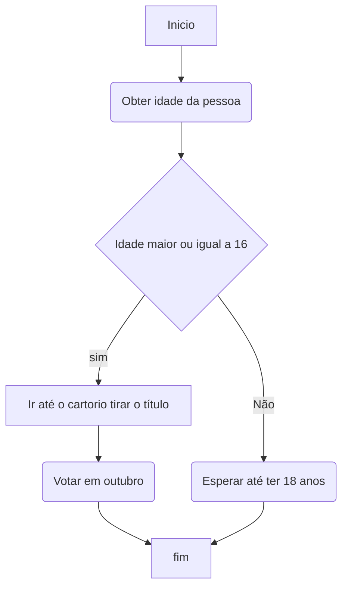

# Estruturas de decisão

Estruturas de decisão, também conhecidas como estruturas condicionais, são construções fundamentais em programação que permitem que um programa tome decisões com base em condições específicas. Essas estruturas permitem que diferentes partes do código sejam executadas ou ignoradas, dependendo do resultado de uma condição avaliada.

## As estruturas de decisão mais comuns são:

### Estrutura de decisão "if": 
A estrutura "if" verifica uma condição e executa um bloco de código se essa condição for verdadeira. Se a condição for falsa, o bloco de código associado ao "if" é ignorado.
    
**Exemplo em pseudocódigo:**

```
se (condição) então
    // Bloco de código a ser executado se a condição for verdadeira
fim se
```

<br>

### Estrutura de decisão "if-else": 
A estrutura "if-else" verifica uma condição e executa um bloco de código se essa condição for verdadeira. Se a condição for falsa, um bloco de código alternativo associado ao "else" é executado.
    
**Exemplo em pseudocódigo:**

```
se (condição) então
    // Bloco de código a ser executado se a condição for verdadeira
senão
    // Bloco de código a ser executado se a condição for falsa
fim se
```

<br>

### Estrutura de decisão "if-else if-else" (também conhecida como "if-else encadeado" ou "if-else-if ladder"):
Essa estrutura permite avaliar múltiplas condições em sequência e executar o bloco de código correspondente à primeira condição verdadeira encontrada. Se todas as condições forem falsas, o bloco de código associado ao "else" é executado.

**Exemplo em pseudocódigo:**

```
se (condição1) então
    // Bloco de código a ser executado se a condição1 for verdadeira
senão se (condição2) então
    // Bloco de código a ser executado se a condição2 for verdadeira
...
senão
    // Bloco de código a ser executado se todas as condições forem falsas
fim se
```

> **OBS:** Essas estruturas de decisão permitem que um programa tome diferentes caminhos de execução com base em condições específicas. Elas são essenciais para a lógica e o controle do fluxo de um programa, permitindo a execução seletiva de blocos de código com base em determinadas situações.

<br>

### Exemplo de fluxograma de estrutura de decisão:
uso de estrutura de decisão para saber se uma pessoa pode tirar o titulo de eleitor.



<br>

<br>

<br>

[Voltar ao inicio](/README.md)