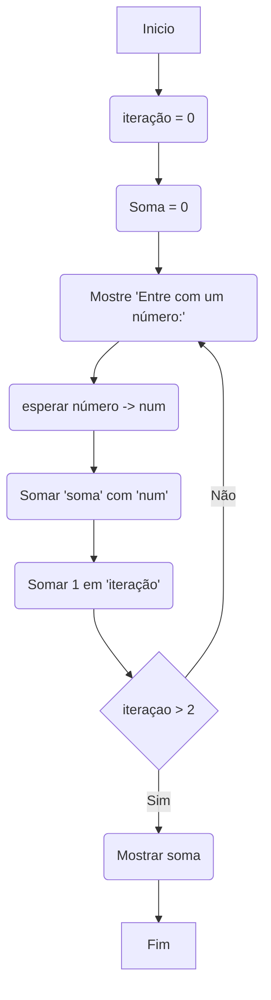

# Estruturas de repetição

As estruturas de repetição, também conhecidas como estruturas de loop, são construções fundamentais na programação que permitem que um bloco de código seja executado repetidamente enquanto uma determinada condição for verdadeira. Essas estruturas são usadas quando é necessário executar um conjunto de instruções várias vezes, simplificando a implementação de repetições e iterações em um programa.

## Existem três tipos principais de estruturas de repetição:

### Loop `while`: 
O loop "while" executa um bloco de código repetidamente enquanto uma condição especificada for verdadeira. Antes de cada iteração, a condição é verificada. Se a condição for verdadeira, o bloco de código é executado; caso contrário, a execução sai do loop.
    
**Exemplo em pseudocódigo:**

```
enquanto (condição) faça
    // Bloco de código a ser repetido
fim enquanto
```

<br>

### Loop `do-while`: 
O loop "do-while" executa um bloco de código pelo menos uma vez e, em seguida, repete a execução enquanto uma condição especificada for verdadeira. Após cada iteração, a condição é verificada. Se a condição for verdadeira, o bloco de código é executado novamente; caso contrário, a execução sai do loop.
    
**Exemplo em pseudocódigo:**

```
faça
    // Bloco de código a ser repetido
enquanto (condição)
```

### Loop `for`: 
O loop "for" executa um bloco de código repetidamente por um número específico de iterações. Ele possui uma estrutura especializada com três partes: a inicialização de variáveis, a condição de continuação e a atualização das variáveis a cada iteração.
    
**Exemplo em pseudocódigo:**

```
para (inicialização; condição; atualização) faça
    // Bloco de código a ser repetido
fim para
```

> **OBS:** Essas estruturas de repetição permitem que um programa execute um conjunto de instruções várias vezes, até que uma condição especificada seja falsa. Elas são úteis quando é necessário processar uma lista de itens, iterar sobre elementos de uma coleção, calcular valores repetidamente, entre outras situações que exigem repetição controlada. As estruturas de repetição fornecem um controle de fluxo poderoso e eficiente para lidar com iterações em programas.

<br>

### Exemplo de uso de loop
solicitar 3 números ao usuário, fazer a soma e mostrar resultado ao final.



<br>

<br>

<br>

[Voltar ao inicio](/README.md)