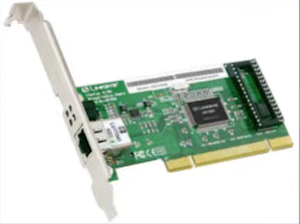
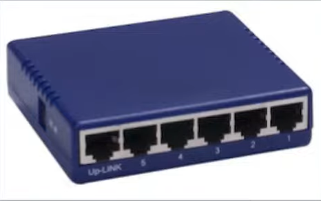
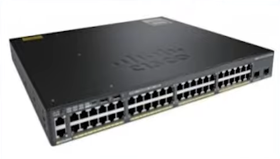
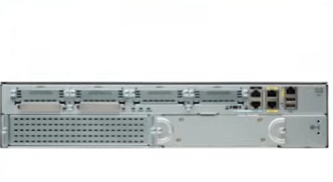
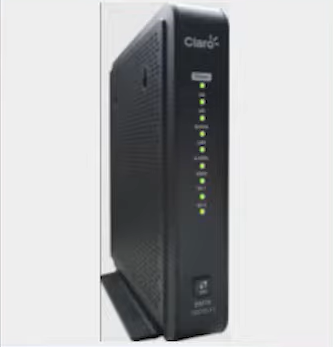

# Infraestrutura de redes e principais equipamentos 

## Placa de rede (NIC)

A sigla NIC significa Network Interface Card, que em português pode ser traduzido como "Placa de Interface de Rede" ou simplesmente "Placa de Rede". Uma placa NIC é um dispositivo de hardware que permite a conexão de um computador a uma rede de computadores.

A placa NIC é responsável por fornecer uma interface física entre o computador e a rede, permitindo a transmissão e recepção de dados. Ela geralmente é instalada internamente no computador, em um slot de expansão na placa-mãe, embora também possa ser uma placa de rede externa conectada por meio de uma porta USB ou outro tipo de conexão.

A função principal de uma placa NIC é converter os dados do computador em sinais que possam ser transmitidos pela rede e receber sinais da rede para que possam ser interpretados pelo computador. Ela também pode fornecer recursos adicionais, como suporte a diferentes padrões de conexão (como Ethernet, Wi-Fi, Fibra Óptica), velocidades de transmissão (como 10/100/1000 Mbps ou Gigabit Ethernet) e recursos de segurança.

 

## Hub

Atualmente não tanto usado, o hub é um dispositivo que permite a conexão entre dispositivos através de cabos de par trançados e conectados entre si. A limitação do hub se deve a ausência de uni cast (Conexão direta entre 2 dispositivos), já que quando é usado todos os dispositivos estarão conectados em uma troca de dados obrigatoriamente.

 

## Switch

Um switch é um dispositivo de rede utilizado para interconectar dispositivos em uma rede local (LAN) e facilitar a comunicação entre eles. Ele atua como um ponto central de conexão para os dispositivos conectados, permitindo a troca de dados de forma eficiente. O switch opera na camada de enlace de dados do modelo OSI (Open Systems Interconnection) e possui várias portas, nas quais os dispositivos podem ser conectados diretamente. 

Cada porta do switch é capaz de transmitir e receber dados independentemente das outras portas, permitindo uma comunicação simultânea entre os dispositivos conectados. Além disso, um switch é capaz de aprender e armazenar os endereços MAC dos dispositivos conectados às suas portas em uma tabela de endereços MAC. Isso permite que o switch encaminhe os pacotes diretamente para o dispositivo de destino com base no seu endereço MAC, reduzindo a necessidade de transmissão de pacotes para todas as portas. Podemos considerar que o switch foi o hardware que substituiu o Hub.

 

## Roteador

Um roteador é um dispositivo de rede que atua como um ponto de conexão entre diferentes redes de computadores. Ele é responsável por direcionar o tráfego de dados entre as redes, permitindo que os dispositivos conectados possam se comunicar entre si e com outras redes. O roteador opera na camada de rede do modelo OSI (Open Systems Interconnection) e é capaz de analisar os endereços IP dos pacotes de dados para determinar o melhor caminho para sua entrega. Ele utiliza tabelas de roteamento, que contêm informações sobre os diferentes destinos de rede e as interfaces pelas quais os pacotes devem ser encaminhados. 

Quando um pacote de dados é recebido por um roteador, ele examina o endereço IP de destino e consulta sua tabela de roteamento para determinar a rota apropriada. O roteador então encaminha o pacote para a próxima interface ou roteador ao longo do caminho, até que o pacote alcance seu destino final. Além de encaminhar o tráfego de dados, os roteadores também podem oferecer outros recursos, como Network Address Translation (NAT), que permite que vários dispositivos compartilhem um único endereço IP público, e firewalls, que fornecem segurança de rede, filtrando o tráfego indesejado.

 

## Modem

Um modem, abreviação de "modulador/ de-modulador", é um dispositivo de rede que converte sinais digitais em sinais analógicos e vice-versa. Ele é utilizado para estabelecer a conexão entre um computador ou rede local e a linha de comunicação de uma operadora de serviços de Internet, como uma linha telefônica, cabo coaxial, fibra óptica ou conexão sem fio. 

Na transmissão de dados, o modem converte os sinais digitais gerados pelo computador em sinais analógicos que podem ser transmitidos pela linha de comunicação, seja ela uma linha telefônica ou outra tecnologia de conexão. No lado receptor, o modem recebe os sinais analógicos da linha de comunicação e os converte novamente em sinais digitais compreensíveis para o computador ou rede. Em essência, o modem atua como um intermediário entre o dispositivo de origem (como um computador) e a rede de comunicação externa (como a Internet), permitindo a transferência de dados através de diferentes meios de comunicação.

 

 

[Voltar ao inicio](/README.md)