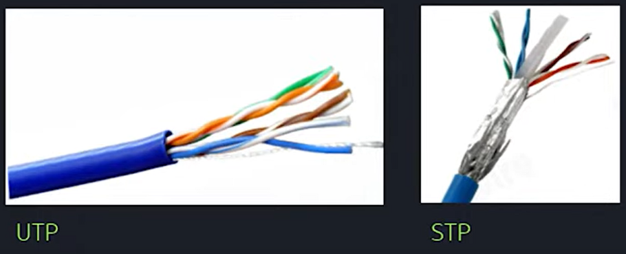
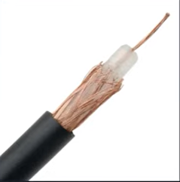
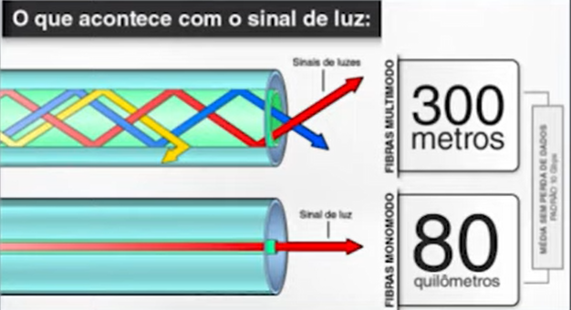
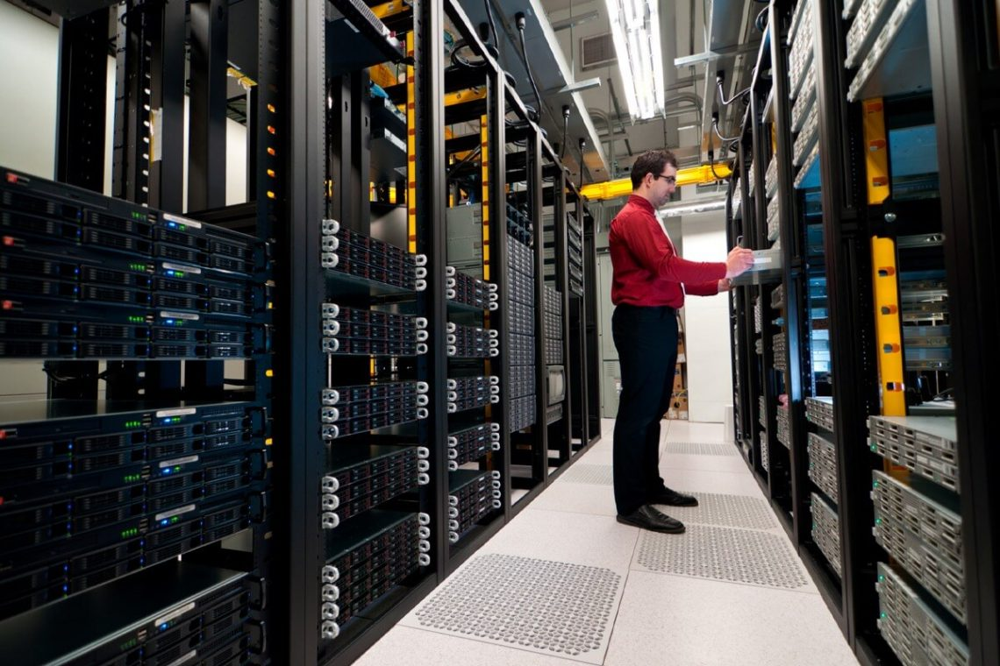

# Cabeamento estruturado

Cabeamento estruturado refere-se a um sistema padronizado de cabeamento de rede que permite a transmissão eficiente e organizada de dados, voz e outros sinais em uma infraestrutura de telecomunicações. É uma abordagem sistemática para a instalação de cabos, conectores e dispositivos de rede, de modo a fornecer flexibilidade, desempenho confiável e fácil gerenciamento.

O cabeamento estruturado segue normas e padrões técnicos estabelecidos para garantir a qualidade, interoperabilidade e escalabilidade das redes de comunicação. As normas mais comuns aplicadas ao cabeamento estruturado são definidas pelas organizações TIA (Telecommunications Industry Association) e ISO/IEC (International Electrotechnical Commission).

### As normas mais amplamente utilizadas para o cabeamento estruturado são:

1. **ANSI/TIA-568-C:** É uma série de normas da TIA que define as especificações técnicas para cabeamento estruturado em edifícios comerciais e residenciais. Ela abrange diferentes componentes, como cabos, conectores, painéis de patch, racks e gerenciamento de cabos.
2. **ISO/IEC 11801:** É uma norma internacionalmente reconhecida para cabeamento estruturado. Ela define requisitos técnicos para o projeto, instalação e desempenho de sistemas de cabeamento de telecomunicações em edifícios comerciais.
3. **NBR 14.565 (ABNT):** A NBR 14.565 é uma norma brasileira estabelecida pela Associação Brasileira de Normas Técnicas (ABNT). Ela define os requisitos técnicos e as diretrizes para a infraestrutura de telecomunicações em edifícios comerciais e residenciais no Brasil. A norma NBR 14.565 abrange diferentes aspectos relacionados ao cabeamento estruturado, como a infraestrutura de dutos, eletrocalhas, racks, espaços de telecomunicações, rotas de cabos, proteção contra incêndio, aterramento, entre outros. Ela visa garantir a instalação adequada e o desempenho confiável dos sistemas de cabeamento em conformidade com as condições brasileiras.

 

## Cabo de par trançado

### Características:

1. **Pares Trançados:** O cabo de par trançado consiste em pares de fios de cobre isolados que são torcidos um ao redor do outro. Essa torção ajuda a minimizar a interferência eletromagnética entre os pares adjacentes, melhorando a qualidade do sinal e reduzindo a perda de dados.
2. **Categorias:** Os cabos de par trançado são classificados em categorias, como Cat 5e, Cat 6, Cat 6a, Cat 7, entre outras. Cada categoria possui especificações técnicas diferentes, como a largura de banda suportada, a taxa de transferência de dados, a capacidade de atenuação do sinal e a imunidade a interferências.
3. **Blindagem:** Alguns cabos de par trançado possuem blindagem adicional para fornecer proteção contra interferências externas, como a blindagem por folha de alumínio (FTP - Foiled Twisted Pair) ou blindagem individual dos pares (STP - Shielded Twisted Pair). Isso ajuda a reduzir ainda mais a interferência eletromagnética e melhora a integridade do sinal.
4. **Conectores:** Os cabos de par trançado geralmente possuem conectores RJ-45 em suas extremidades. Esses conectores são padronizados e amplamente utilizados em redes Ethernet. Eles permitem uma conexão fácil e segura aos dispositivos de rede, como computadores, roteadores, switches e outros equipamentos.
5. **Distâncias e Aplicações:** Os cabos de par trançado têm limites de distância para garantir um desempenho adequado do sinal. Essas distâncias podem variar de acordo com a categoria do cabo. Eles são amplamente utilizados em redes locais (LANs), sistemas de telefonia, sistemas de segurança e outras aplicações de comunicação de dados.
6. **Flexibilidade:** Os cabos de par trançado são flexíveis e fáceis de instalar, tornando-os uma escolha conveniente para diferentes ambientes. Eles podem ser usados em instalações internas, externas e em ambientes industriais.

 

## Cabo coaxial

O cabo coaxial é um tipo de cabo de transmissão utilizado em diversas aplicações, incluindo telecomunicações, televisão a cabo e redes de computadores. 

### Suas principais características são:

1. **Construção:** O cabo coaxial possui um condutor central, normalmente feito de cobre, que é cercado por uma camada isolante. Em seguida, há uma blindagem metálica que protege o sinal contra interferências externas. Por fim, há uma camada externa isolante que proporciona proteção mecânica e isolamento elétrico.
2. **Blindagem:** A blindagem do cabo coaxial ajuda a minimizar a interferência eletromagnética, protegendo o sinal contra ruídos externos e mantendo a integridade do sinal ao longo da transmissão.
3. **Largura de Banda:** O cabo coaxial tem uma largura de banda relativamente alta, permitindo a transmissão de sinais de alta frequência com eficiência. Isso o torna adequado para aplicações que requerem transmissão de dados em alta velocidade, como em redes de televisão a cabo ou redes de computadores.
4. **Distância de Transmissão:** O cabo coaxial é capaz de transmitir sinais a distâncias consideráveis, mantendo a qualidade do sinal. A distância máxima de transmissão varia dependendo da frequência e do tipo de cabo coaxial utilizado.
5. **Conectores:** O cabo coaxial utiliza conectores específicos, como os conectores tipo F ou BNC, para estabelecer a conexão com os dispositivos. Esses conectores garantem uma conexão segura e confiável.
6. **Aplicações:** O cabo coaxial é comumente utilizado em sistemas de TV a cabo, redes de computadores, sistemas de vigilância por vídeo e em outras aplicações que requerem transmissão de sinais de alta frequência e confiabilidade.

 

## Cabo fibra óptica

Um cabo de fibra óptica é um tipo de cabo de transmissão que utiliza fibras de vidro ou plástico para transmitir sinais de luz. 

### Suas principais características são:

1. **Alta largura de banda:** Os cabos de fibra óptica possuem uma largura de banda extremamente alta, permitindo a transmissão de grandes volumes de dados em alta velocidade. Isso os torna ideais para aplicações que exigem transmissão de dados de alta velocidade, como redes de telecomunicações e Internet de alta velocidade.
2. **Transmissão de longa distância:** As fibras ópticas permitem a transmissão de sinais a longas distâncias sem perda significativa de sinal. Isso significa que os cabos de fibra óptica podem ser usados em redes que abrangem grandes áreas geográficas, como redes de longa distância e cabos submarinos.
3. **Imunidade a interferências eletromagnéticas:** A transmissão de luz em fibras ópticas não é afetada por interferências eletromagnéticas externas, como campos magnéticos ou elétricos. Isso proporciona uma transmissão de sinal mais confiável e estável, especialmente em ambientes com interferências eletromagnéticas significativas.
4. **Segurança:** Os cabos de fibra óptica são intrinsecamente seguros, pois a transmissão de luz não emite radiação eletromagnética significativa. Além disso, como os sinais ópticos não são facilmente interceptados, os cabos de fibra óptica são mais seguros contra violações de segurança e espionagem em comparação com outros tipos de cabos.
5. **Menor perda de sinal:** A atenuação do sinal em cabos de fibra óptica é significativamente menor do que em outros meios de transmissão, como cabos de cobre. Isso permite uma transmissão de sinal mais eficiente e de maior alcance sem a necessidade de repetidores frequentes.
6. **Leveza e tamanho compacto:** Os cabos de fibra óptica são mais leves e têm tamanho físico menor em comparação com cabos de cobre de capacidade semelhante. Isso facilita a instalação e o gerenciamento de cabos em infraestruturas de rede.
7. **Resistência a condições ambientais adversas:** Os cabos de fibra óptica são altamente resistentes a influências ambientais, como umidade, variações de temperatura, corrosão e interferências elétricas. Isso os torna adequados para uso em ambientes externos e industriais desafiadores.

 

## Rack

Um rack, também conhecido como gabinete ou armário de equipamentos, é uma estrutura projetada para acomodar e organizar diversos componentes eletrônicos e de rede em um ambiente de tecnologia. Ele oferece um espaço físico seguro e organizado para a montagem e interconexão de equipamentos, como servidores, switches, roteadores, patch panels, entre outros.

O rack é composto por uma estrutura metálica vertical que possui trilhos ou guias ajustáveis em sua parte interna, permitindo a instalação e fixação dos equipamentos em posições padronizadas. Essa padronização é importante para garantir a compatibilidade e a intercambiabilidade dos dispositivos.

 

 

[Voltar ao inicio](/README.md)