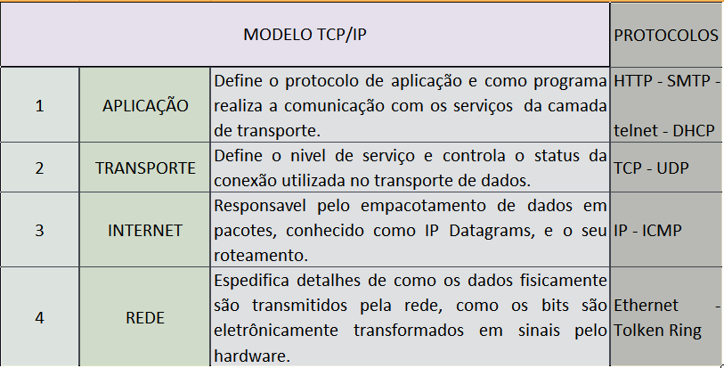
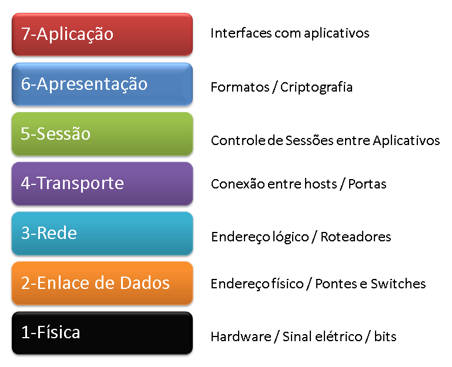
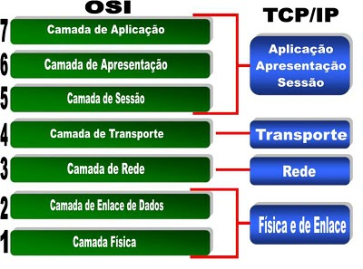
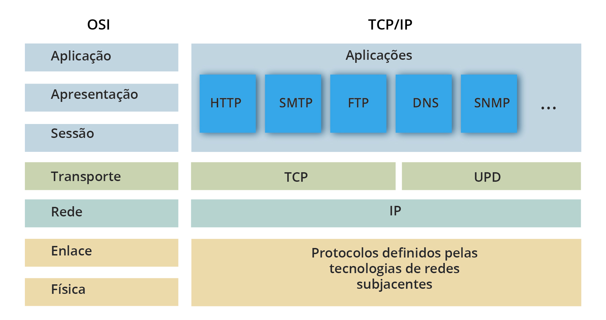

# Modelo OSI e modelo TCP-IP

## Camadas TCP-IP

O modelo TCP/IP (Transmission Control Protocol/Internet Protocol) é um conjunto de protocolos de comunicação utilizados para a transmissão de dados em redes de computadores. Ele é amplamente adotado como o modelo de referência para a arquitetura da Internet e serve como base para a comunicação entre dispositivos em uma rede.

### O modelo TCP/IP é composto por quatro camadas distintas:

1. **Camada de Aplicação:** A camada de aplicação é responsável por fornecer serviços de rede para os aplicativos e usuários finais. Ela inclui protocolos como HTTP (Hypertext Transfer Protocol), FTP (File Transfer Protocol), SMTP (Simple Mail Transfer Protocol) e DNS (Domain Name System), que permitem a comunicação e a transferência de dados entre aplicativos em diferentes dispositivos na rede.
2. **Camada de Transporte:** A camada de transporte é responsável pelo transporte dos dados de forma confiável e eficiente entre os dispositivos finais. O protocolo TCP (Transmission Control Protocol) é o protocolo mais comum nessa camada. Ele divide os dados em pacotes, estabelece conexões e garante a entrega ordenada e confiável desses pacotes. Outro protocolo utilizado nessa camada é o UDP (User Datagram Protocol), que é mais adequado para transmissões em tempo real, mas não oferece a mesma confiabilidade que o TCP.
3. **Camada de Internet:** A camada de internet lida com o endereçamento e o roteamento dos pacotes de dados através da rede. O protocolo IP (Internet Protocol) é o protocolo principal dessa camada e permite a identificação única de cada dispositivo conectado à rede através de endereços IP. Ele também é responsável por rotear os pacotes de dados pelos nós da rede até seu destino final.
4. **Camada de Acesso à Rede:** A camada de acesso à rede é responsável pela transmissão física dos dados na rede. Ela lida com os detalhes de hardware e transmissão, como a interface de rede, os meios de transmissão (como cabos de par trançado, fibra óptica ou redes sem fio) e os protocolos de acesso ao meio, como Ethernet.

 

## Camadas OSI

O modelo OSI (Open Systems Interconnection) é um modelo de referência para arquitetura de redes de computadores. Ele foi desenvolvido pela ISO (International Organization for Standardization) como uma abordagem padronizada para descrever as funções e os processos envolvidos na comunicação de rede.

### O modelo OSI é composto por sete camadas distintas:

1. **Camada Física:** É a camada mais baixa do modelo OSI e lida com a transmissão física dos bits por meio dos meios de comunicação, como cabos, sinais elétricos ou ondas de rádio. Ela define as características elétricas, mecânicas e de procedimento para estabelecer e manter a conexão física.
2. **Camada de Enlace de Dados:** A camada de enlace de dados lida com a comunicação direta entre dispositivos adjacentes na rede. Ela garante uma transmissão livre de erros, encapsulando os dados em quadros e fornecendo detecção e correção de erros, controle de fluxo e controle de acesso ao meio.
3. **Camada de Rede:** A camada de rede é responsável pelo roteamento dos pacotes de dados através da rede. Ela determina a melhor rota para os pacotes e lida com a fragmentação e a montagem dos dados, se necessário.
4. **Camada de Transporte:** A camada de transporte fornece serviços de transporte confiável e orientado a conexões. Ela garante a entrega ordenada e confiável dos dados, dividindo-os em segmentos e estabelecendo conexões lógicas entre os dispositivos finais.
5. **Camada de Sessão:** A camada de sessão estabelece, gerencia e finaliza as sessões de comunicação entre aplicativos. Ela permite o controle do diálogo entre os dispositivos, incluindo o estabelecimento, a manutenção e o término da conexão.
6. **Camada de Apresentação:** A camada de apresentação lida com a representação dos dados para garantir a interoperabilidade entre diferentes sistemas. Ela realiza funções como codificação, compressão, criptografia e formatação dos dados.
7. **Camada de Aplicação:** A camada de aplicação é a camada mais alta do modelo OSI e fornece serviços de rede diretamente aos aplicativos e usuários finais. Ela abriga protocolos específicos de aplicativos, como HTTP, FTP, SMTP, entre outros.

 

 

### Equivalência de camadas OSI e TCP-IP

 

### Exemplos de protocolos usado nas camadas TCP-IP/ OSI

 

 

 

[Voltar ao inicio](/README.md)