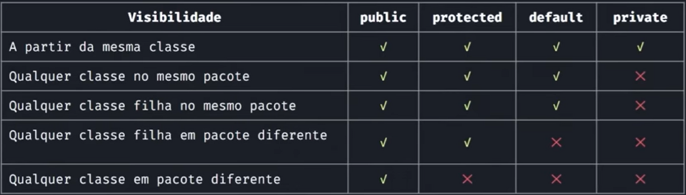

# Modificadores de acesso, construtor, getters e setters e encapsulamento 

## Modificadores de acesso em Java 

São palavras-chave que definem o nível de acesso de classes, atributos, métodos e construtores em um programa. Eles controlam a visibilidade e a acessibilidade dos elementos em diferentes partes do código-fonte.

Os modificadores de acesso desempenham um papel importante na encapsulação e no controle de acesso aos elementos de uma classe. Eles permitem definir a visibilidade adequada para proteger a integridade dos dados e garantir que o código seja usado corretamente. A escolha adequada do modificador de acesso depende dos requisitos de acesso e do nível de encapsulamento desejado para cada elemento da classe.

### Existem quatro modificadores de acesso em Java:



<br>

<br>


#### `public` 
O acesso é ilimitado, sem restrições. Os membros públicos podem ser acessados de qualquer lugar, em qualquer classe.
    
**Caracteristicas**:
    
- Acesso ilimitado, sem restrições.
- Os membros públicos podem ser acessados de qualquer lugar, em qualquer classe.
- Podem ser acessados por classes no mesmo pacote ou em pacotes diferentes.

<br>

#### `private` 
O acesso é restrito à própria classe. Os membros privados só podem ser acessados dentro da classe em que são declarados. Eles não são visíveis para outras classes, mesmo que estejam no mesmo pacote.
    
**Caracteristicas:**
    
- Acesso restrito à própria classe.
- Os membros privados só podem ser acessados dentro da classe em que são declarados.
- Não são visíveis para outras classes, mesmo que estejam no mesmo pacote.

<br>

#### `protected`
O acesso é limitado ao pacote e às subclasses. Os membros protegidos podem ser acessados dentro da classe, em subclasses e em classes do mesmo pacote. No entanto, eles não podem ser acessados por classes fora do pacote, a menos que sejam subclasses.
    
**Caracteristicas:**
    
- Acesso limitado ao pacote e às subclasses.
- Os membros protegidos podem ser acessados dentro da classe, em subclasses e em classes do mesmo pacote.
- Não podem ser acessados por classes fora do pacote, a menos que sejam subclasses.

<br>

#### Default 
(sem especificação de modificador): Também conhecido como acesso de pacote ou acesso padrão. Os membros com acesso padrão são acessíveis apenas dentro do mesmo pacote. Eles não podem ser acessados por classes em pacotes diferentes, mesmo que sejam subclasses.

**Caracteristicas:**

- Também conhecido como acesso de pacote ou acesso padrão.
- Os membros com acesso padrão são acessíveis apenas dentro do mesmo pacote.
- Não podem ser acessados por classes em pacotes diferentes, mesmo que sejam subclasses.
- É o nível de acesso quando nenhum modificador é especificado.

<br>

## Getters e setters

Os métodos getters e setters são métodos usados para acessar e modificar os atributos de uma classe, respectivamente. Eles seguem a convenção de nomenclatura JavaBeans e são amplamente utilizados para implementar o princípio de encapsulamento. 

Os métodos getters e setters são úteis porque permitem um acesso controlado aos atributos privados de uma classe. Eles encapsulam os detalhes internos da implementação, fornecendo uma interface pública consistente e controlada para interagir com os atributos. Isso facilita a manutenção do código.

### Getters (Acessores):

- São métodos públicos usados para obter o valor de um atributo privado.
- Permitem acesso controlado aos atributos privados, fornecendo apenas o valor desejado.
- Seguem o padrão de nomenclatura.

### Métodos Setters (Modificadores):

- São métodos públicos usados para modificar o valor de um atributo privado.
- Permitem atribuir um novo valor a um atributo privado, aplicando regras ou validações, se necessário.
- Seguem o padrão de nomenclatura.

<br>

## Construtor

É um tipo especial de método usado para inicializar objetos quando eles são criados a partir de uma classe. O construtor é responsável por realizar ações necessárias para configurar o estado inicial do objeto, definindo os valores dos atributos ou executando outras operações importantes.

A principal característica de um método construtor é que ele tem o mesmo nome da classe em que está definido. Quando um objeto é criado usando o operador `new`, o construtor correspondente é invocado automaticamente para inicializar o objeto.

Os métodos construtores podem receber parâmetros ou não. Um construtor sem parâmetros é chamado de construtor padrão ou construtor vazio. Já um construtor com parâmetros permite passar valores específicos durante a criação do objeto, que serão utilizados para configurar seus atributos.

### Alguns pontos importantes sobre métodos construtores:

- Eles não têm tipo de retorno, nem mesmo `void`.
- Eles podem ser sobrecarregados, ou seja, uma classe pode ter vários construtores com assinaturas diferentes.
- Um construtor pode chamar outro construtor da mesma classe usando a palavra-chave `this` para evitar duplicação de código.
- Os construtores podem ser usados para garantir que os objetos estejam em um estado consistente após sua criação, inicializando todos os atributos necessários.
- Caso o tonstrutor tenha parâmetros, e não se tenha um construtor padrão vazio, o objeto instanciado (criado) deverá receber todos os atributos equivalentes.

**Exemplo de uso de construtor:**

```java
/*Classe Pessoa*/

public class Pessoa {
    private String nome;
    private int idade;
    
		//Método construtor
    public Pessoa(String nome, int idade) {
        this.nome = nome;
        this.idade = idade;
		}

		//Getters
		public String getNome() {
        return nome;
    }
    public int getIdade() {
        return idade;
    }
}
```

```java
/*Classe Main*/

public class Main {
    public static void main(String[] args) {
        Pessoa pessoa1 = new Pessoa("João", 25);
        System.out.println("Nome: " + pessoa1.getNome());
        System.out.println("Idade: " + pessoa1.getIdade());
    }
}
```

<br>

## Encapsulamento

O encapsulamento é um princípio de programação orientada a objetos que consiste em ocultar os detalhes internos de uma classe e fornecer acesso controlado aos seus membros. Ele visa proteger os dados e o comportamento de uma classe, permitindo que sejam acessados e manipulados apenas por meio de métodos públicos.

- O encapsulamento promove a segurança, modularidade e flexibilidade do código, evitando o acesso direto aos atributos de uma classe e permitindo que as operações sejam realizadas de forma consistente por meio dos métodos públicos disponíveis (Getters e Setters).

**Exemplo de uso de encapsulamento:**

```java
/*Classe pessoa*/

public class Pessoa {
		//Atributos encapsulados como "private" (Encapsulados)
    private String nome;
    private int idade;
    
    // Métodos getters e setters usados para acessar e definir atributos
    public void setNome(String nome) {
        this.nome = nome;
    }
		public void setIdade(int idade) {
        this.idade = idade;
    }
		
		public String getNome() {
        return nome;
    }
    public int getIdade() {
        return idade;
    }
}
```

<br>

```java
/*Classe main*/

public class Main {
    public static void main(String[] args) {
        Pessoa pessoa1 = new Pessoa();
        
				//Definindo atributos (Atribuição indireta por setters)
        pessoa1.setNome("João");
        pessoa1.setIdade(25);
        
				//Impressão indireta de atributos por getters
        System.out.println("Nome: " + pessoa1.getNome());
        System.out.println("Idade: " + pessoa1.getIdade());
    }
}
```

<br>

<br>

<br>

[Voltar ao inicio](/README.md)