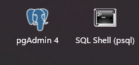

# Baixar e instalar o PostgreSQL

[Link postegreSQL](https://www.postgresql.org/download/)

 

### Após a instalação veremos esses 2 icones:

- Shell é a opção para gerenciar o banco em terminal.
- PgAdmin é um gerenciamento por Gui bem interessante.

 

 

 

[Voltar ao inicio](/README.md)
